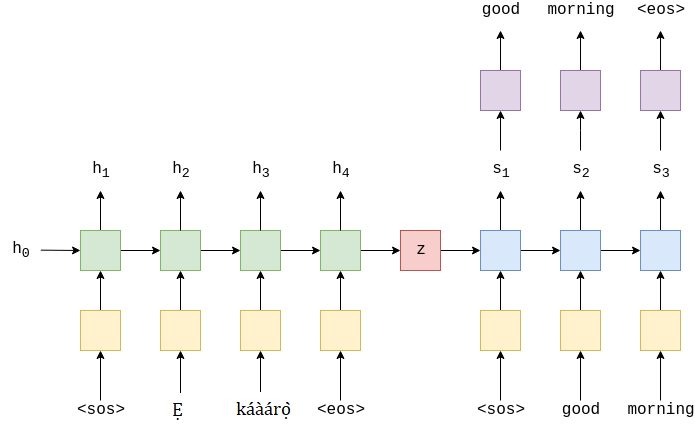

<h1 align="center">English to Yoruba Translation using RNN</h1>

<h4 align="center">A beginner's approach to Sequence to Sequence modeling</h4>

 

<h2>Table of Contents</h2>

- [Overview](#overview)
- [Dataset](#dataset)
- [Model](#model)
- [Result](#result)

<h2>Overview</h2>

This project is a beginner’s approach to Sequence to Sequence (Seq2Seq) modeling with Recurrent Neural Networks (RNNs), specifically LSTMs. My aim here is to understand the foundation of Seq2Seq modeling and progressively build my understanding of NLP workflow.

Some of my past projects on natural language processing include:

- <a href="https://github.com/Oyebamiji-Micheal/Sentiment-Analysis-of-Spotify-Songs" target="_blank">Sentiment Analysis of Spotify Songs</a>
- <a href="https://github.com/Oyebamiji-Micheal/Quora-Insincere-Questions-Classification-using-TF-IDF" target="_blank">Quora Insincere Questions Classification using TF-IDF</a>
- <a href="https://github.com/Oyebamiji-Micheal/Predicting-Disaster-Tweets-using-Bag-of-Words" target="_blank">Predicting Disaster Tweets using Bag of Words</a>

In this project, I implemented a Seq2Seq model using RNN (LSTM). The approach is straightforward, with a basic word-level tokenizer and no advanced tokenization techniques like BPE. The goal is to get familiar with the typical Seq2Seq modeling workflow, rather than focusing on achieving state-of-the-art results.

<h2>Dataset</h2>

The dataset used for this project was obtained from the <a href="https://zindi.africa/competitions/ai4d-yoruba-machine-translation-challenge" target="_blank">Zindi AI4D Yoruba Machine Translation Challenge</a>. It consists of 10,000 Yoruba to English parallel sentence pairs. 

<h2>Model</h2>

In the notebook, I followed a tutorial by <a href="https://github.com/bentrevett/pytorch-seq2seq" target="_blank">Bentrevett</a>, based on the paper <a href="https://arxiv.org/abs/1409.3215" target="_blank">Sequence to Sequence Learning with Neural Networks</a>.
While the original paper uses a 4-layer architecture, he used a simpler 2-layer setup for both the encoder and decoder, focusing on building a fundamental understanding of how Seq2Seq models work. Training was done for 10 epochs.

<h2>Result</h2>

Given the limited dataset size and the simple model architecture, I was not expecting so much. However, this project helped me learn how to work with Seq2Seq models: from preparing the data, building the encoder and decoder, to training the model and evaluating it. In the future, I aim to explore more interesting techniques like using pre-trained word embeddings and different tokenization methods. 

See you in the next one 🙂
